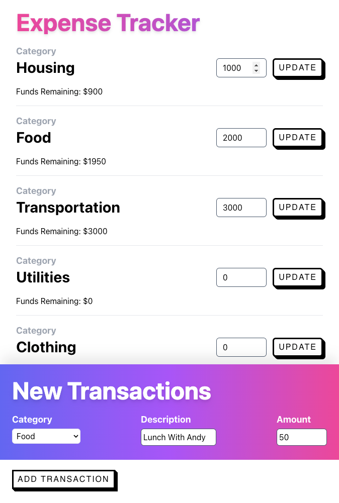

# Expense Tracker

UPDATE: So, I did my previous project of [shoe-store](https://github.com/arulhasbi/clothing-store) to getting know about react state-management using Redux. Well, though I successfully passing data around, turns out I did it in a an inefficient way and such practice may cause future problem when the app is scaled.

Problem 1: 

```
const root = ReactDOM.createRoot(document.getElementById("root"));
const render = () => {
  root.render(
    <React.StrictMode>
      <App state={store.getState()} dispatch={store.dispatch} />
    </React.StrictMode>
  );
};
store.subscribe(render);
render();
```

I performed an unnecessary overhead calling of `root.render(...)` whenever I dispatch an action to change the current state due to the subscription in `store.subscribe(render)`. Basically, I re-render the whole thing and its not the intended implementation for rendering React components.

Problem 2:

I passed `state` and `dispatch` references through props `<App state={store.getState()} dispatch={store.dispatch} />` which adds unneeded complexity and might be difficult to keep track of errors as the number of components increases.


Therefore, in this expenses-tracker project, I learned two useful Redux libraries which are react-redux and redux-toolkit. With these tools, I had better:

**Accessibility**: The `store` is more accessible by all of the components whithin the application. Then, avoid props-drilling.

**Rendering**: Subscribing inidivdual components to the specific pieces of the application for optimized-rendering. So, no need re-render the whole thing.

I know all of these are still at the surface but I hope that I have a better understanding now about react state-management and see you guys in the next react project. Peace!.
 
### Project Screen Shots



### Dependencies

- [@faker-js](https://fakerjs.dev/): `^7.6.0`
- [styled-components](https://styled-components.com/): `^5.3.6`
- [Tailwind CSS](https://tailwindcss.com/): `^3.2.1`
- redux: `^4.2.0`
- react-redux: `^8.0.5`
- @reduxjs/toolkit: `^1.9.0`

### Available Scripts

In the project directory, you can run:

### `npm install`

To install all of the needed dependencies, then:

### `npm start`

Runs the app in the development mode.\
Open [http://localhost:3000](http://localhost:3000) to view it in your browser.

You may also see any logs in the console when performing any form submission event.
